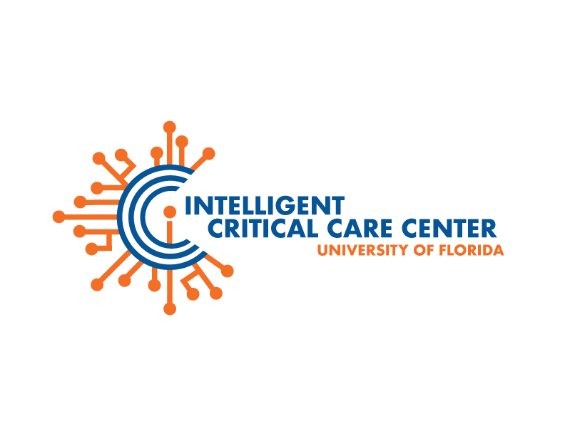

# Intelligent Critical Care Center
*Department of Medicine, University of Florida*

**Intelligent Critical Care Center(IC3)** is a cross-disciplinary research center established to address an unprecedented opportunity for world-leading ambient, immersive and artificial intelligence (AI) research and innovation to transform the diagnosis, monitoring, and treatment for critically and acutely ill patients using the multimodal clinical and research data and resources stemming from UF Health
(UFH), one of the Florida’s largest health care system.

The Center will be strategically tied to research and educational mission to advance the UF AI initiative. 

[visit our homepage](ic3.center.ufl.edu)

